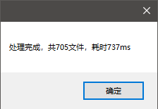
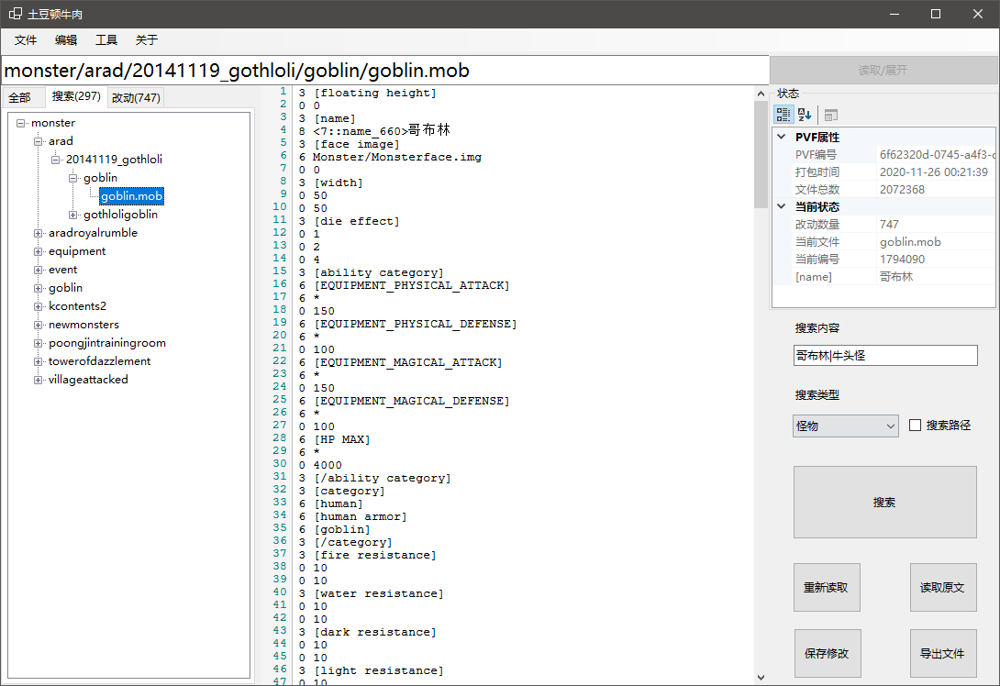

# EFCore Script

```bash
#User table
add-migration InitMyTable -c UserContext
update-database -Context UserContext

#EFCore
Add-Migration InitConfiguration -Context ConfigurationDbContext -o Data\Migrations\IdentityServer\ConfiguragtionDb
update-database -Context ConfigurationDbContext

Add-Migration InitConfiguration -Context PersistedGrantDbContext -o Data\Migrations\IdentityServer\PersistedGrantDb
update-database -Context PersistedGrantDbContext
```


# UI

- 处理所有技能只需要大概700ms



- 快速搜索，装备、物品、怪物、任务、地图、副本



- 一份数据源多人分离编辑
- 合并目录脚本支持快速加入自己的代码